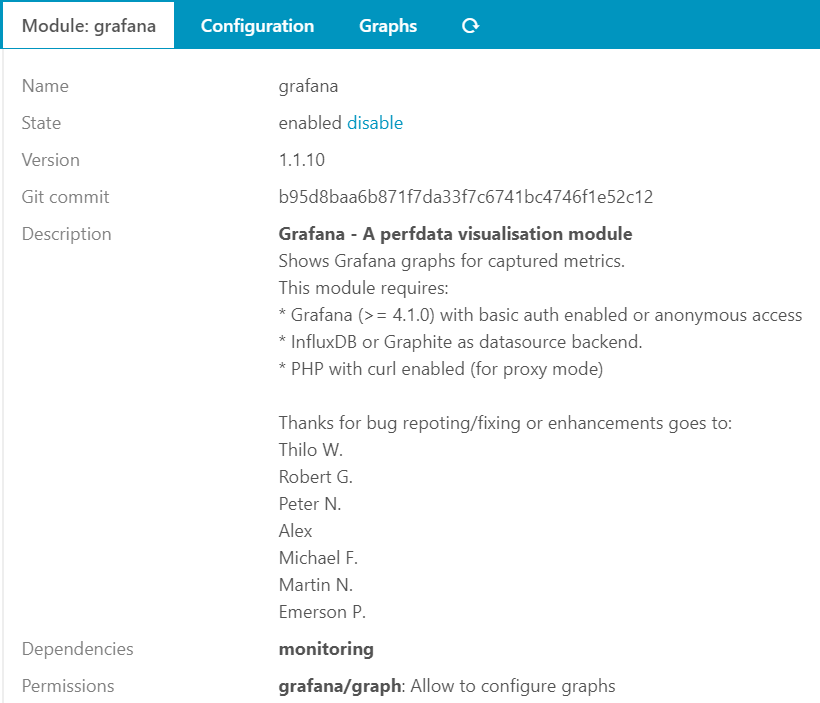
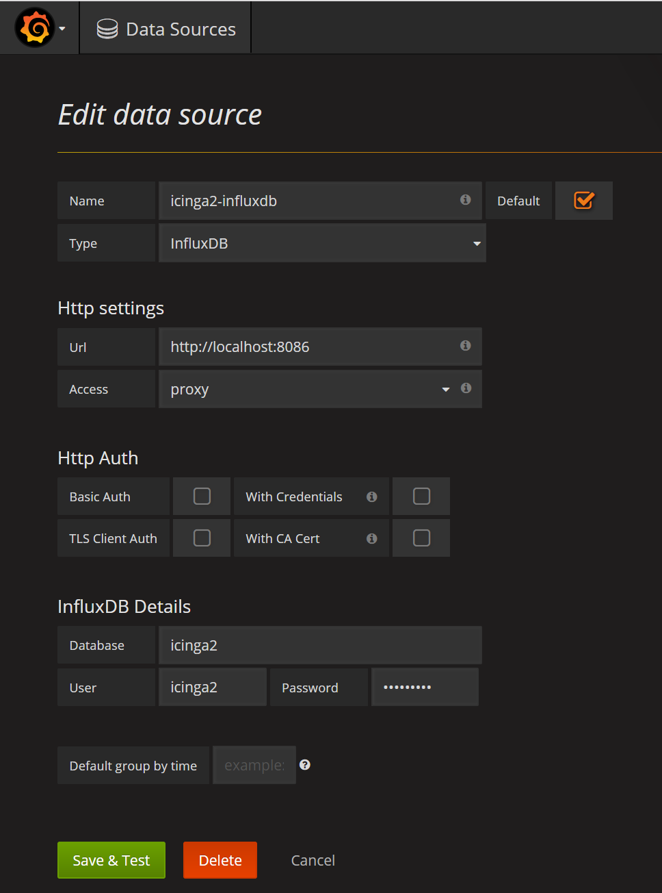
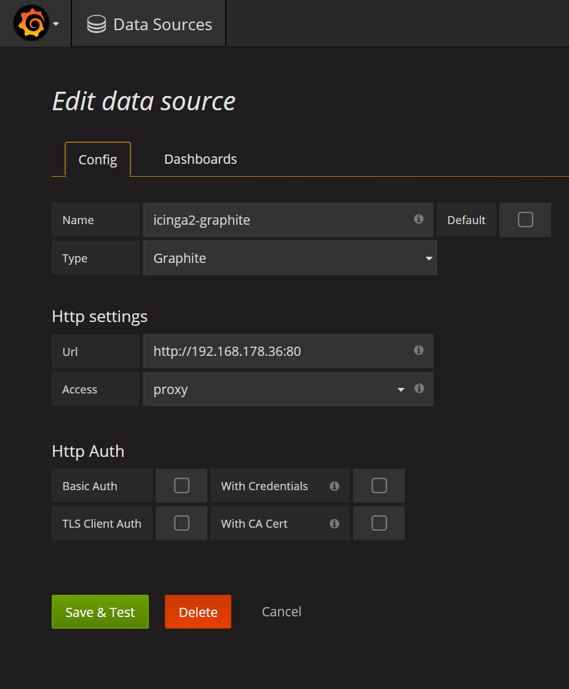
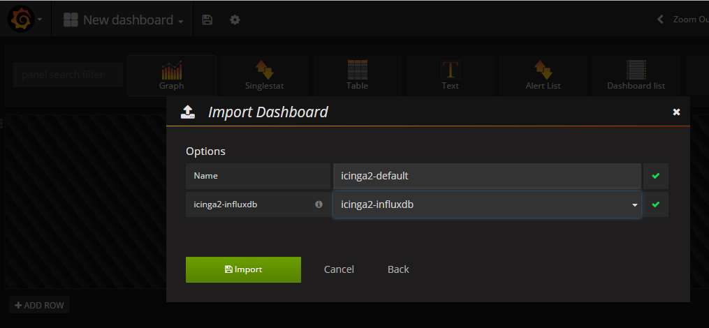
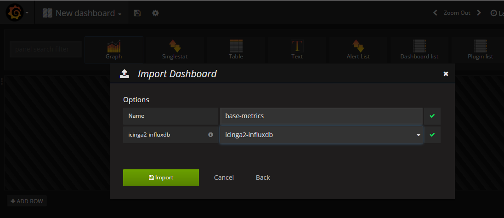

# Installation

These are the instruction to install the Icinga Web 2 module Grafana.
In case you already installed Grafana module and want to update
to the latest version, please [read on here](05-update.md).

## Requirements

* [Icinga Web 2](https://www.icinga.com/products/icinga-web-2/) (>= 2.4.1)
* [Grafana](https://grafana.com/) (>= 4.1)
* [InfluxDB](https://docs.influxdata.com/influxdb/) (>= 1.0) [Graphite](https://graphiteapp.org) or [PNP](https://docs.pnp4nagios.org/) (untested) as backend for Grafana
* [PHP 7](https://www.php.net) **with curl enabled** (for proxy mode)


## Install the Grafana module

As with any Icinga Web 2 module, installation is pretty straight-forward. In
case you're installing it from source all you have to do is to drop the grafana
module in one of your module paths. You can examine (and set) the module path(s)
in `Configuration / Application`. In a typical environment you'll probably drop the
module to `/usr/share/icingaweb2/modules/grafana`. Please note that the directory
name MUST be `grafana` and not `icingaweb2-module-grafana` or anything else.

### Git clone

Use this only if you want tu use/test the latest developer version of the module.

```
ICINGAWEB_MODULEPATH="/usr/share/icingaweb2/modules"
REPO_URL="https://github.com/Mikesch-mp/icingaweb2-module-grafana"
TARGET_DIR="${ICINGAWEB_MODULEPATH}/grafana"
git clone "${REPO_URL}" "${TARGET_DIR}"
```

### Tarball

Replace the version number with the lates available version from [Latest Release](https://github.com/Mikesch-mp/icingaweb2-module-grafana/releases/latest)

```
MODULE_VERSION="1.1.7"
ICINGAWEB_MODULEPATH="/usr/share/icingaweb2/modules"
REPO_URL="https://github.com/Mikesch-mp/icingaweb2-module-grafana"
TARGET_DIR="${ICINGAWEB_MODULEPATH}/grafana"
URL="${REPO_URL}/archive/v${MODULE_VERSION}.tar.gz"
install -d -m 0755 "${TARGET_DIR}"
wget -q -O - "$URL" | tar xfz - -C "${TARGET_DIR}" --strip-components 1
```

### Enable the module 

In the Icinga Web 2 frontend in `Configuration -> Modules -> grafana -> enable`.



You can also enable the module by using the `icingacli` command:

```
icingacli module enable grafana
```

## Grafana Preparations

Depending on which mode (proxy/indirect proxy/direct/iframe) you want to use you have to set some configuration in Grafana

### For 'proxy' or 'indirect proxy' mode

If you don't want anonymous access you have to create a user (with password) and enable basic auth in grafana.ini

```
 #################################### Basic Auth ##########################
 [auth.basic]
 enabled = true
```

If you want to allow anonymous access (read only) enable "Anonymous Auth" in grafana.ini and set default organization

```
 #################################### Anonymous Auth ##########################
 [auth.anonymous]
 # enable anonymous access
 enabled = true

 # specify organization name that should be used for unauthenticated users
 org_name = Koebbes

 # specify role for unauthenticated users
 org_role = Viewer
```

For API-Token access you need to create an API-Token with Grafana. See the [Grafana Docs](http://docs.grafana.org/tutorials/api_org_token_howto/#how-to-create-a-new-organization-and-an-api-token) on how to create one

### For 'direct' & 'iframe' mode

You have to enable "Anonymous Auth" in grafana.ini and set default organization or users need
to be logged in into Grafana first to see graphs in Icinga Web 2.

```
 #################################### Anonymous Auth ##########################
 [auth.anonymous]
 # enable anonymous access
 enabled = true

 # specify organization name that should be used for unauthenticated users
 org_name = Koebbes

 # specify role for unauthenticated users
 org_role = Viewer
```

### Create Grafana datasource

Create a datasource depending on the metric backend you want to use.

#### InfluxDB example


#### Graphite example


### Import dashboards

Depending which metric backend (influxdb/graphite) you use, import the 2 provided dashboards.

#### icinga2-default dashboard


#### base-metrics dashboard


