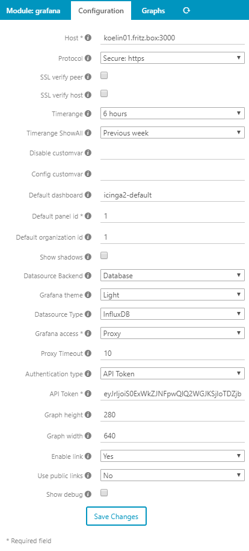

# Module configuration
Here you will learn howto configure the module and details about the options you can choose.

---

## Global configuration
The configuration can be done via web interface or by editing the configuration inifile directly.

### Configuration with web interface
Browse to [/icingaweb2/config/modules#!/icingaweb2/grafana/config](/icingaweb2/config/modules#!/icingaweb2/grafana/config). Here you can set all the options descripted below.




---
### Configuration by editing inifile

On most ditributions, if you used the repository as install source, you will find the configuration file in `/etc/icingaweb2/modules/grafana`.

If the directory does not exists create it with 

```bash
install -d -m 0755 -g icingaweb2 /etc/icingaweb2/modules/grafana
```

Then use your prefered editor to create the file config.ini in the just created or existing directory.

#### Example config.ini (/etc/icingaweb2/modules/grafana/config.ini)

```ini
[grafana]
username = "your grafana username"
host = "hostname:3000"
protocol = "https"
password = "123456"
height = "280"
width = "640"
timerange = "3h"
timerangeAll = "1M/M"
enableLink = "yes"
defaultorgid = "1"
defaultdashboard = "icinga2-default"
shadows = "1"
datasource = "influxdb"
defaultdashboardstore = "db"
accessmode = "proxy"
timeout = "5"
directrefresh = "no"
usepublic = "no"
publichost = "otherhost:3000"
publicprotocol = "http"
custvardisable = "idontwanttoseeagraph"
debug = "0"
ssl_verifypeer = "0"
ssl_verifyhost = "0"
```

---

## Options

|Setting            | Short description|
|-------------------|-------------------|
|host               | **Required.** Grafana server host name (and port).|
|protocol           | **Optional.** Protocol used to access the Grafana server. Defaults to `http`.|
|height             | **Optional.** Global graph height in pixel. Defaults to `280`.|
|width              | **Optional.** Global graph width in pixel. Defaults to `640`.|
|timerange          | **Optional.** Global time range for graphs. Defaults to `6h`.|
|timerangeAll       | **Optional.** Time range for all graphs feature. Defaults to `Previous week`.|
|enableLink         | **Optional.** Enable/disable graph with a rendered URL to the Grafana dashboard. Defaults to `yes`.|
|datasource         | **Required.** Type of the Grafana datasource (`influxdb`, `graphite` or `pnp`). Defaults to `influxdb`.|
|defaultdashboard   | **Required.** Name of the default dashboard which will be shown for unconfigured graphs. Set to `none` to hide the module output. **Important: `panelID` must be set to `1`!** Defaults to `icinga2-default`.|
|shadows            | **Optional.** Show shadows around the graphs. ** Defaults to `false`.|
|defaultorgid       | **Required.** Number of the default organization id where dashboards are located. Defaults to `1`.
|defaultdashboardstore | **Optional.** Grafana backend (file or database). Defaults to `Database`.|
|accessmode         | **Optional.** Controls whether graphs are fetched with curl (`proxy`), are embedded (`direct`) or in iframe ('iframe'). Direct access is faster and needs `auth.anonymous` enabled in Grafana. Defaults to `proxy`.|
|timeout            | **Proxy only** **Optional.** Timeout in seconds for proxy mode to fetch images. Defaults to `5`.|
|authanon           | **Ignore** Only used for configuration via web interface.|
|username           | **Proxy non anonymous only** **Required** HTTP Basic Auth user name to access Grafana.|
|password           | **Proxy non anonymous only** **Required** HTTP Basic Auth password to access Grafana. Requires the username setting.|
|directrefresh      | **Direct Only** **Optional.** Refresh graphs on direct access. Defaults to `no`.|
|usepublic          | **Optional** Enable usage of publichost/protocol. Defaults to `no`.|
|publichost         | **Optional** Use a diffrent host for the graph links.|
|publicprotocol     | **Optional** Use a diffrent protocol for the graph links.|
|custvardisable     | **Optional** Custom variable (vars.idontwanttoseeagraph for example) that will disable graphs. Defaults to `grafana_graph_disable`.|
|custvarconfig      | **Optional** Custom variable (vars.usegraphconfig for example) that will be used as config name. Defaults to `grafana_graph_config`.|
|theme              | **Optional.** Select grafana theme for the graph (light or dark). Defaults to `light`.|
|debug              | **Optional.** Enables the debug information under the graph if the user has permission to see them. Defaults to `disabled`.|
|ssl_verifypeer     | **Proxy mode only** **Optional.** Verify the peer's SSL certificate. Defaults to `false`.|
|ssl_verifyhost     | **Proxy mode only** **Optional.** Verify the certificate's name against host. Defaults to `false`.|


---

### host
**Required** Hostname and port or Grafana url depending on your Grafana installation.

For example `127.0.0.1:300` or `localhost:3000` or `grafana-host-domain.tld/grafana` or `10.111.1.1/grafana`

### protocol
The protocol used to fetch images (and for the links to graphs if enabled). If you use proxy mode with non anonymous access, it is highly
recommended to use secure protocol (https).

### height
The default height used for the graphs in pixels. Defaults to `280` pixels.
This option can be overwritten by a graph configuration.

### width
The default width used for the graphs in pixels. Defaults to `640` pixels.
This option can be overwritten by a graph configuration.

### timerange
The default timerange used for the graphs. Defaults to `6 hours`.
This option can be overwritten by a graph configuration.

### timerangeAll
Time range for all graphs feature. Defaults to `Previous week`

### enableLink
Enable or disable the graphs as a link to the Grafana Server.

### datasource
The datasource that Grafana server uses. Can be InfluxDB, Graphite and PNP (untested).

### defaultorgid
Number of the default organization id where dashboards are located. Defaults to `1`.
You can fetch the id if you browse to your grafana server menu -> Admin -> Global Orgs

### defaultdashboard
The name of the default dashboard that is used when **no graph is configured** for your service, host or command.
The panel id used for this dashboard will always be **"1"** and **cannot be changed**
See [04-graph configuration](04-graph-configuration.md) for details about how to configure graphs.

### defaultdashboardstore
The dashboard store, `database`or `file`, that is used by Grafana server. Defaults to `database`

### shadows
Enable/Disable fancy shadows around the graph image.

### accessmode
Controls ihow the graphs are fetched/delivered for/to the users. Defaults to `proxy`.

#### Proxy
With this mode the graphs are feteched with curl on **server side**. The image will be served by Icingaweb2 to the users.
Pro: Very secure
Contra: slower page rendering, because Icingaweb2 needs to load the image first from Grafana.

### ssl_verifypeer
Verify the peer's SSL certificate. Defaults to `false`.
Read [CURLOPT_SSL_VERIFYHOST](https://curl.haxx.se/libcurl/c/CURLOPT_SSL_VERIFYHOST.html) for mor informations.

### ssl_verifyhost
Verify the certificate's name against host. Defaults to `false`.
Read [CURLOPT_SSL_VERIFYPEER](https://curl.haxx.se/libcurl/c/CURLOPT_SSL_VERIFYPEER.html) for mor informations.

#### Direct
With `direct` access, the graph images are loaded from the users directly from the Grafana server.
Pro: fast page rendering, refresh of graph can be disabled by option.
Contra: Less secure then proxy mode. Needs `auth.anonymous` enabled in Grafana.

#### Iframe
In Iframe mode you have the full power of Grafana features like mouse over tooltip.
Pro: All features from Grafana enabled. Fast page rendering.
Contra: Less secure, page refresh from Icingaweb2 will be distracting! Needs `auth.anonymous` enabled in Grafana.

### timeout
Used with 'proxy' mode only.
Timeout in seconds for loading graph images from Grafana server. Defaults to `5 seconds`.
If you often get a timeout message then the image, raise this to 10 or more seconds.

### authanon
This option is only used for the web configuration to hide/show username and password options.

### username
Used with 'proxy' mode, non anonymous access only.
The username used to authenticate to Grafana server.

### password
Used with 'proxy' mode, non anonymous access only.
The password used to authenticate to Grafana server.

### usepublic
Enables/Disables the usage of a `public` URL to the Grafana server.
If you have set your grafanaurl for example to localhost then you can set here a url that is used for to link to Grafana.

### publichost
Used with 'usepublic = yes'.
Public host name and port. Same as `host` option.

### publicprotocol
Used with 'usepublic = yes'.
The protocol used for the links to graphs.

### custvardisable
Name of the custom variable (vars.idontwanttoseeagraph for example) that will disable graphs if set to true. Defaults to `grafana_graph_disable`.

### custvarconfig
Name of the custom variable (vars.usegraphconfig for example) that will be used as graph config name. Defaults to `grafana_graph_config`.
This will overwrite the search order and force the module to use the graph configuration name that the variiable points to.
For example you have `vars.grafana_graph_config = "check_my_tesla"` in your service configuration, the module will look for
an [graph configuration](04-graph-configuration.md) that is named `check_my_tesla` and use this to render/show the performance graph.
If there is no such a configuration, the `default-template` will be used.

### theme
The Grafana theme that will be used. Defaults to `light`.

### debug
Show debug informtions if user has permission to see them. Defaults to `false`.