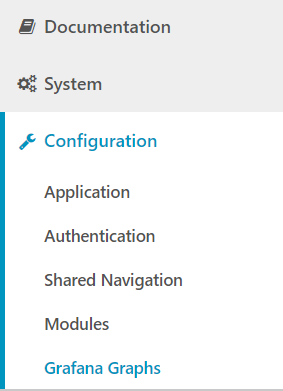
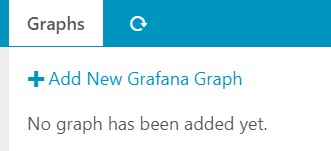
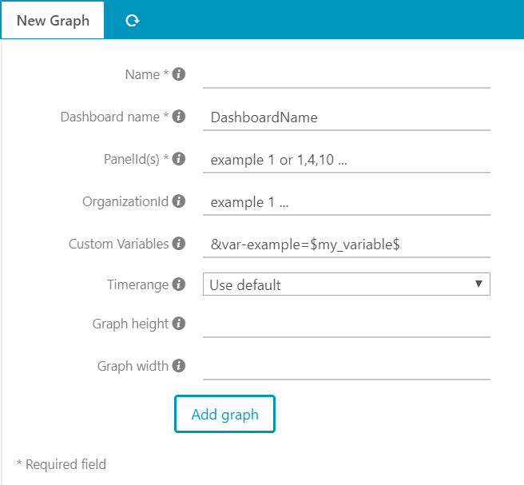
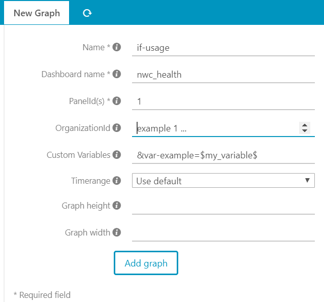
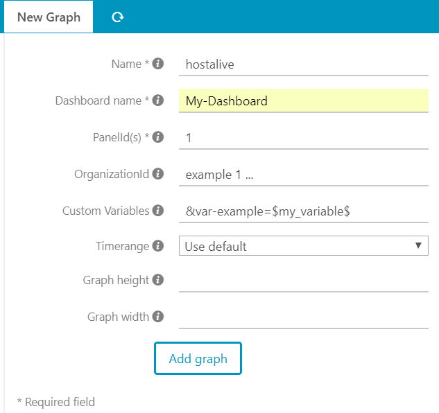
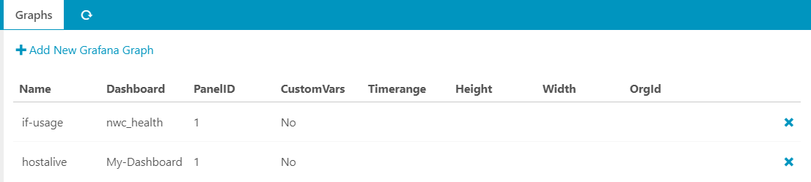

# Configuring Graphs

You can add specific graph configuration settings in Icinga Web 2 in `Configuration -> Grafana Graphs`.



---
## Options
Setting            | Description
-------------------|-------------------
name               | **Required.** The name of the `service` (not the `display_name`) or `parametrized service name` or `check_command` where a graph should be rendered.
dashboard          | **Required.** Name of the Grafana dashboard to use.
panelId            | **Required.** Graph panelId. Open Grafana and select to share your dashboard to extract the value.
orgId              | **Optional.** Organization Id where the dashboard is located. Overrides global default.
customVars         | **Optional.** Set additional custom variables used for Grafana.
timerange          | **Optional.** Specify the time range for this graph.  Overrides global default.
height             | **Optional.** Graph height in pixel. Overrides global default.
width              | **Optional.** Graph width in pixel. Overrides global default.
repeatable         | **Optional.** Defines a dashboard with auto repeating panels per metric. Defaults to "no".
nmetrics           | **Optional.** Defines the number of metrics in an auto repeating panel. Defaults to 1 if repeatable is yes.

Example:
```
vim /etc/icingaweb2/modules/grafana/graphs.ini

[check_command]
dashboard = "my-own"
panelId = "42"
orgId = "1"
customVars = "&os=$os$"
timerange = "3h"
height = "100"
width = "150"
repeatable = "yes"
nmetrics = "1"

```

---

## Service(s)

### Name search order

This module prefers the `service name`, then looks for an optional `parametrized service name` and for the `service check command name`.

If there is no match, it will use the default dashboard as fallback.

Example Icinga2 host + service configuration

```
object Host "HeinBloed" {
  import "icinga-host"

  address = "127.0.0.1"

  vars.interfaces["ens3"] = {
  }
}

apply Service "if-usage " for (interface_name => config in host.vars.interfaces) {
  import "generic-service"

  check_command = "nwc_health"

  vars.nwc_health_mode = "interface-usage"
  vars.nwc_health_name = interface_name

  vars += config
}
```
At first glance `Name = "if-usage ens3"` must provide a match. Then `if-usage` (`parametrized service name`) and last but not least any service
`check_command` attribute which is set to `nwc_health`.

### Add new service graph

To add a new graph configuration click on `Add New Grafana Graph`



This opens a new tab with the configuration options



We will use the `parametrized service name` "if-usage" in our example, the dasboard named `nwc_health` and the graph with panelid 1.



After hitting the `Add graph` button we see our new graph configuration.


### Auto repeating panels

If you set a graph to be autorepeating your Grafana dashboard must provide the repeating panels by its own.
The formula for how many panels will be shown is

´´´
Number of service perfdata metrics / number of metrics per panel config (nmetrics)
´´´

The Dasboard needs templating for metrics of a service like
```
SHOW TAG VALUES FROM /^COMMAND_NAME$/ WITH KEY = "metric" where hostname =~ /^$hostname$/ and service =~ /^$service$/
``` 

See [Repeating Rows and Panels](http://docs.grafana.org/guides/whats-new-in-v2-1/#repeating-rows-and-panels) for more information.

---

## Host(s)

For host you just need to use the `check_command` name as service name for the graph configuration. 
The default `check_command` mostly `hostalive`. To get a list of your hosts and the check_command 
used for the host use this code snippet in your shell

```bash
echo "host.name -> check_command" ; icinga2 object list --type host | awk '/__name/{NAME=$4; next} /check_command/{ print NAME " -> " $4}' | tr -d '"'
```

Example output of the above command

```
Amazon -> hostalive
Fritz.Box -> hostalive
koelin01.fritz.box -> hostalive
koebbes -> hostalive
koelin02 -> hostalive
koenas.fritz.box -> hostalive
```

---

### Add host graph

To add a new graph configuration click on `Add New Grafana Graph`


This opens a new tab with the configuration options


Fill in the name of the `check_command` name we just discovered above as **__Name__**, the dashboard name
and the panelid of the graph you want to use. Thats it :)

Example:



Results in:


