# Create Grafana dashboards for Graphite backend

To create your own graphs you need to create a new [dashboard](http://docs.grafana.org/guides/basic_concepts/#dashboard) with a [panel](http://docs.grafana.org/guides/basic_concepts/#panel) in Grafana.
In this example we create a dashboard for the command ping6, open the menu and go to `Dashboards` -> `New`.

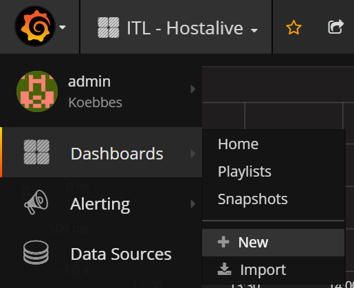

First go to the dashboard settings () and change the name to `ITL-ping6`.
Also if you want add description, row names, links etc.
To save your changes, just hit the :floppy_disk: icon.

## Templating

We use templateing to get a map from var-[hostname|servicename|command] to a Grafana variable. We will set this as a query to InfluxDB and later if you want we change it to an constant.
Open the `Templating` settings and hit the  button.
The variable name has to be `hostname`, `service` or `command` for the use with the grafana module.
The `Datasource` should point to your Graphite datasource.
Set the `Type` to `Query`, Refresh to `On Dashboard Load` and if you want, set `Sort` to what preferred sort order.

 * Hostname query

```
 icinga2.*
```

 * Service query

```
 icinga2.$hostname.services.*
```

 * Command query

```
 icinga2.$hostname.*.*
```

The complete templating should now look like this

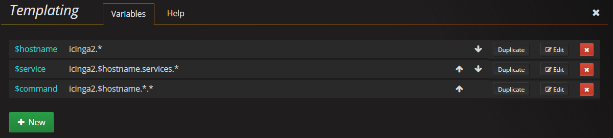

Close the templateing and hit the :floppy_disk: icon to save the dashboard we made so far.

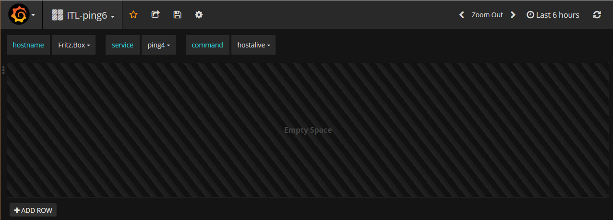

## Add Panel (Graph)

Now we add a new `Panel` to our dashboard, click on the 3 points in the left side of the row and choose `Add Panel`

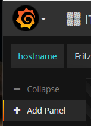

We want to add `Graph`

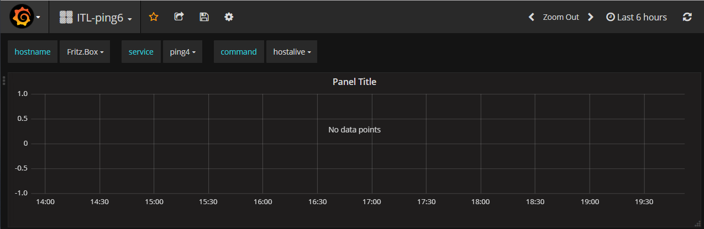

To edit the graph, move your mouse over the graph title (Panel Title) and click on it.
Choose `Edit` from the opened menu. Now you will see a new menu below the graph.


## Edit Panel Metrics (Metrics Tab)

 1. Change the `Data Source` to your Graphite data source if it is not your default data source.
 2. Change `select metric`to `icinga2`.
 3. As second field `select metric` choose `$hostname`.
 4. Next field add `services`.
 5. Next field add `$service`for the services.
 6. Now you can had code the command used or use `$command`
 7. Add the fields `perfdata`, `*`, `value` and `aliasByNode(6)` in this order to the query.

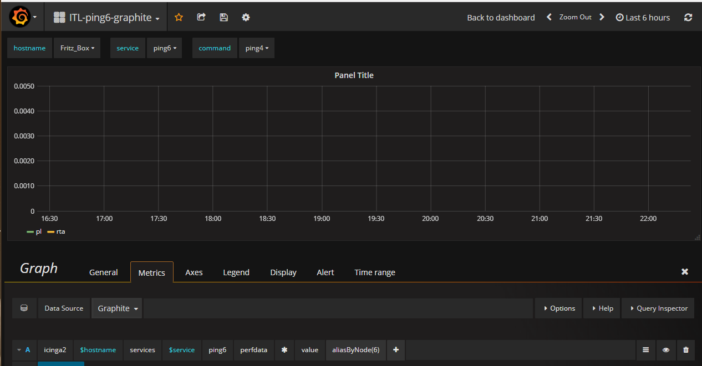

You will not see any lines until you change `Stacking & Null value` to `connected` in at the **Display** tab!

### Add Critical & Warning (optional)

Adding thresholds will change the Y-axis range, so you will not see as much details of your metric as without them.

 1. For **critical** duplicate the **A** query to **B**
 2. Remove the `aliasByNode(6)`.
 3. Change `value` to `crit` on query **B**
 4. Add `substr(6.0) on query **B**
 5. For **warning** duplicate the **B** query to **C**
 6. Change `crit` to `warn` on query **C**

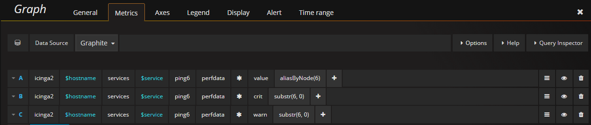

You will not see any lines until you change `Stacking & Null value` to `connected` in at the **Display** tab!

## Change axis for second metric/thresholds (pl)

As ping6 has `rta` and `pl` metrics and they have different units, we can use both Y axis.
Change the `pl`, `pl.warn`and `pl.crit` axis by clicking on the small colored line and choose `Right` as `Y Axis`.


## Change colors for values/tresholds

To change the colors the quick way just click on the small colored line infront of the metric/thresholds in the legend.

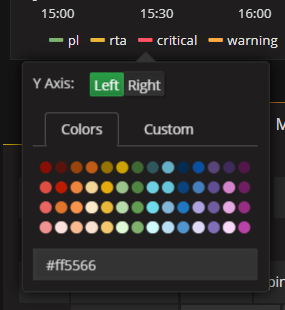

The default Icinga2 color for critical is `#ff5566` and for warning it is `#ffaa44`

Dont forget to hit the :floppy_disk: from time to timee to save your dashboard.

## Change graph title (General tab)

Here enter a title for your graph or leave it empty. If you want to set it to the service name, enter `$service` in the `Title` field.
To make your colleagues happy, enter also a short description (optional), the field support markdown :smiley:.

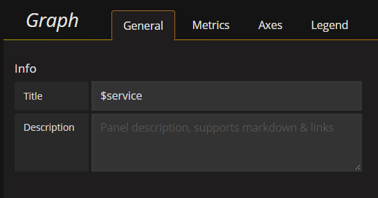

## Axis Units (Axis tab)

Set the left Y axis unit to `seconds` (Icinga2 stores all time based metrics in seconds) for the `rta` metric.
The left Y axis we set to `percent: (0-100)`, the `Y-Min` and `Decimals` to **0**, because pl is a percentage without decimals.

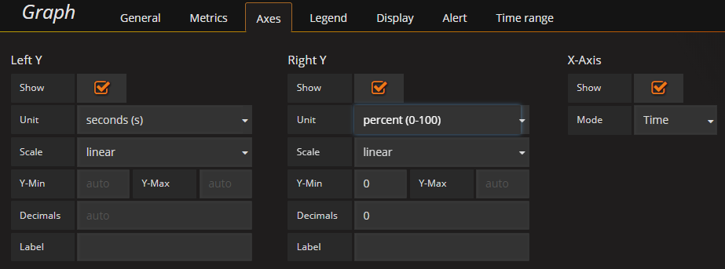

## Legend (Legend tab)

Activate `As Table`, `Min`, `Max`, `Avg` and `Current` to have some more information shown.
If you want to hide metrics with only **0** in the choosen time range, activate **Hide series** `With only zeros` too.

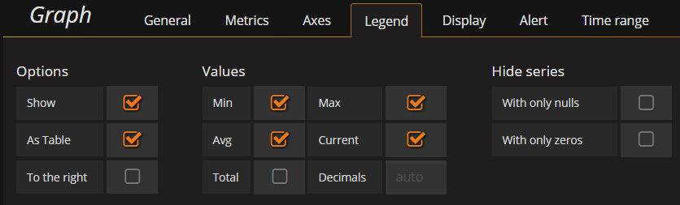

## Display (Display tab)

### Draw options

Set `Stacking & Null value` to `connected` and you will see the lines :smiley:

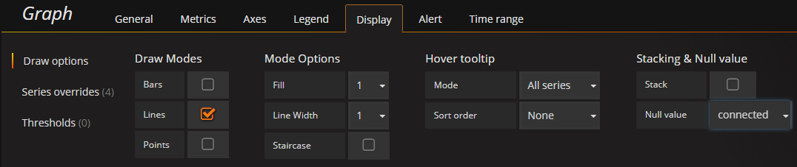

### Series overrides for thresholds

For thresholds we remove the the line filling, so they will only be a thin line.
To add a new override click first on `Series overrides` and then on the `+ Add overrides`
Insert `/critical|warning/`(the alias we used in the query) into `alias or regex`, add `Line fill:0` and `Legend: false` to it.


## Final dashboard

### With thresholds

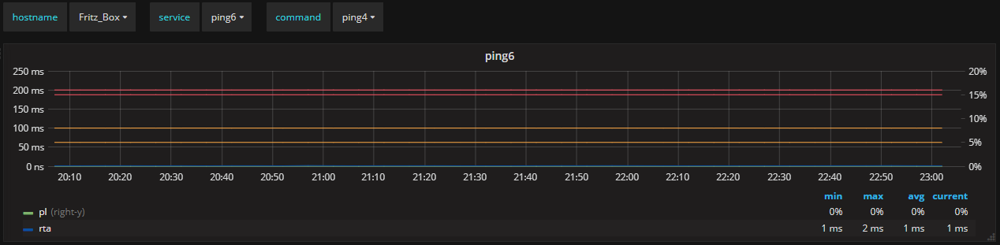

### Without thresholds

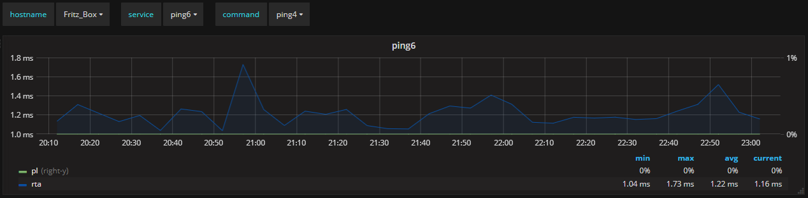
